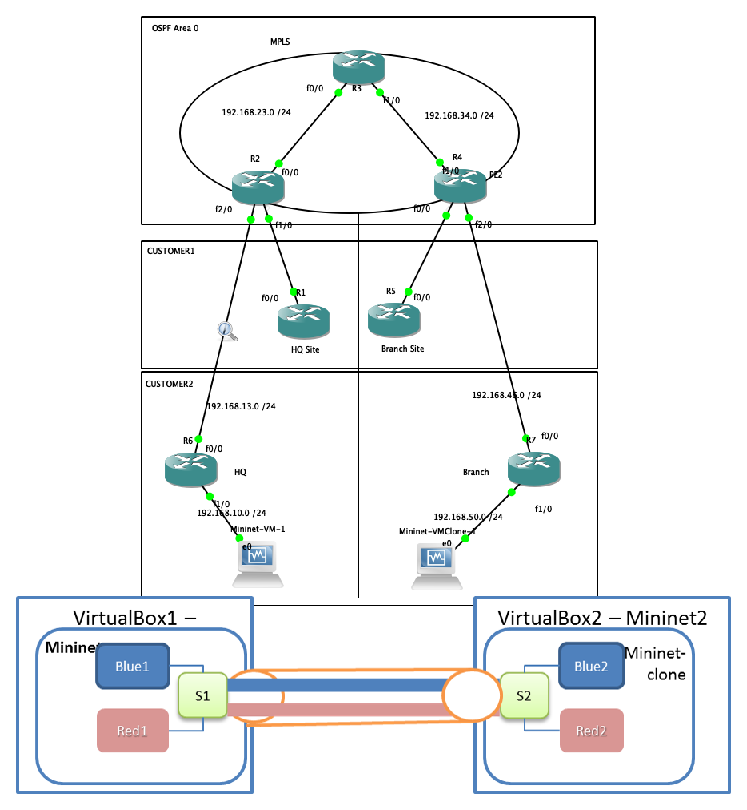

# VxLAN over MPLS in GNS3

## This example shows setup VxLAN over MPLS in GNS3.

This lab basically combines two different labs and makes it into one common story for creating VxLAN over MPLS. 

1. [Basic MPLS VPN] (https://gns3vault.com/mpls/basic-mpls-vpn/) setup is very nicely explained in the gns3vault site 
2. For VxLAN setup using Mininet - Firstly a great explanation by David Mahler in [VXLAN overlay networks with Open vSwitch](https://www.youtube.com/watch?v=tnSkHhsLqpM) and similar lab also recreated with some useful python code for creation of mininet topology explained in [Mininet VXLAN example](https://www.youtube.com/watch?v=QUmRUSqaAzc) video.

For more explanation check [VxLAN over MPLS in GNS3](https://medium.com/@undefinednetworking/vxlan-over-mpls-in-gns3-db0da6ec29a9)

